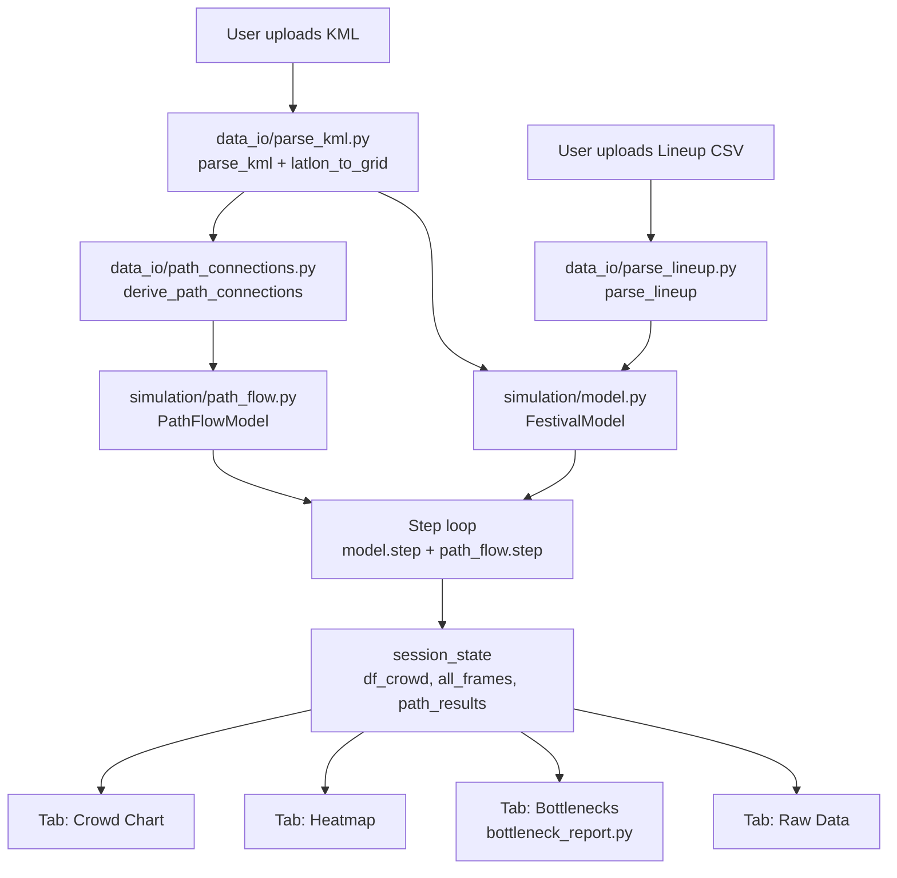

# Design Document — Festival Crowd Bottleneck Simulator

## Overview

The Festival Crowd Bottleneck Simulator is a Streamlit web application that helps festival consultants at Vantage Methods identify crowd bottleneck risks on shared walkways during set transitions. It takes a venue KML file and a lineup CSV as inputs, runs an agent-based crowd simulation, and produces interactive visualizations including an animated heatmap, a crowd distribution chart, and a bottleneck report.

The current codebase has a working simulation engine but suffers from three structural problems: broken imports caused by a flat file layout, a hardcoded EDC Orlando path-to-stage mapping that prevents the app from working with any other venue, and no separation between simulation logic, data I/O, and UI code. This design addresses all three while preserving the proven simulation behavior.

### Key Design Goals

1. **Venue-agnostic**: Replace the hardcoded `path_stage_map` dict in `app.py` with automatic path-to-stage connection derivation from KML geometry.
2. **Clean module boundaries**: Reorganize into `simulation/`, `data_io/`, `config/`, `scripts/`, and `archive/` so each concern lives in one place.
3. **Reliable imports**: Every module imports from its new canonical location; no circular dependencies.
4. **Preserved simulation correctness**: The agent-based model logic, path flow pipe model, and Fruin LoS thresholds are unchanged — only their location and wiring change.
5. **Polished bottleneck report**: A dedicated tab with a timeline of HIGH/CRITICAL events, per-path density charts with threshold lines, and crossover period highlighting.

---

## Architecture

### Folder Structure

```
festival-simulation/
├── app.py                          # Streamlit entry point (unchanged name)
├── requirements.txt
├── .gitignore                      # includes data/
├── simulation/
│   ├── __init__.py
│   ├── model.py                    # renamed from model_edc.py
│   └── path_flow.py                # moved from root
├── data_io/
│   ├── __init__.py
│   ├── parse_kml.py                # moved from root
│   ├── parse_lineup.py             # extracted from app.py
│   └── path_connections.py         # NEW — automatic path-to-stage derivation
├── config/
│   ├── __init__.py
│   └── defaults.py                 # stage weight/wander defaults, threshold constants
├── scripts/
│   ├── run_edc.py                  # updated imports
│   └── validate_density.py         # NEW — validation script for Req 11.3
├── archive/
│   ├── model.py                    # original prototype
│   ├── run_festival.py
│   └── heatmap.py
├── data/                           # gitignored output directory
└── tests/
    ├── __init__.py
    ├── test_parse_kml.py
    ├── test_parse_lineup.py
    ├── test_path_connections.py
    ├── test_path_flow.py
    ├── test_simulation.py
    └── test_bottleneck_report.py
```

### High-Level Data Flow



### Module Dependency Graph

```
app.py
  ├── data_io.parse_kml
  ├── data_io.parse_lineup
  ├── data_io.path_connections
  ├── simulation.model
  ├── simulation.path_flow
  └── config.defaults

simulation.model        (no internal deps)
simulation.path_flow    (no internal deps)
data_io.parse_kml       (no internal deps)
data_io.parse_lineup    (no internal deps)
data_io.path_connections
  └── data_io.parse_kml (types only)
config.defaults         (no internal deps)
```

No circular dependencies. All simulation and data-I/O modules are pure Python with no Streamlit imports, making them independently testable.

---

## Components and Interfaces

### `data_io/parse_kml.py`

Moved from root. Public interface is unchanged:

```python
def parse_kml(filepath: str) -> tuple[
    list[dict],   # stages: [{name, lat, lon}]
    list[dict],   # obstacles: [{name, coords}]
    list[dict],   # paths: [{name, coords}]
    list[tuple],  # venue_bounds: [(lat, lon), ...]
    list[tuple] | None  # entry_exit: [(lat, lon), ...] | None
]: ...

def latlon_to_grid(
    stages, obstacles, paths, venue_bounds,
    grid_size: int = 200,
    entry_exit=None
) -> tuple[
    list[dict],       # grid_stages: [{name, x, y}]
    list[dict],       # grid_obstacles: [{name, cells}]
    list[dict],       # grid_paths: [{name, waypoints, cells, width_m}]
    np.ndarray,       # obstacle_mask: bool[grid_size, grid_size]
    float,            # meters_per_cell
    set[tuple[int,int]]  # entry_cells
]: ...
```

The `width_m` field on each grid path is populated from the KML `<description>` tag if present (format: `width_m: 11.3`), falling back to `8.0` if absent. This replaces the hardcoded `path_widths` dict.

### `data_io/parse_lineup.py`

Extracted from `app.py`. Handles all CSV parsing and time conversion:

```python
def parse_lineup(
    df: pd.DataFrame,
    stage_positions: dict[str, tuple[int, int]],
    genre_similarity: dict[tuple[str, str], float],
    start_hour: int
) -> tuple[
    list[dict],  # stage_configs for FestivalModel
    int,         # total_steps
    list[str]    # warnings (unmatched stage names)
]: ...

def parse_time(time_str: str) -> tuple[int, int]:
    """Parse '9:05pm' or '21:05' → (hour_24, minute)."""

def time_to_step(hour: int, minute: int, start_hour: int) -> int:
    """Convert 24h time to simulation step (5 min per step)."""

def step_to_time(step: int, start_hour: int) -> str:
    """Convert step number to display string like '9:05 PM'."""
```

### `data_io/path_connections.py`

New module. Replaces the hardcoded `path_stage_map` in `app.py`:

```python
def derive_path_connections(
    grid_paths: list[dict],
    grid_stages: list[dict],
    proximity_threshold_cells: int = 30
) -> list[dict]:
    """
    For each path, find which stages it connects by geometric proximity.

    Returns path_flow_configs:
    [
      {
        "name": str,
        "length_m": float,
        "width_m": float,
        "connects": [(stage_a, stage_b), ...]
      },
      ...
    ]

    Algorithm:
    1. For each path, collect all stages within proximity_threshold_cells
       of any waypoint on the path.
    2. The "connected stages" are those within threshold of the first or
       last waypoint (endpoints), plus any stage within threshold of any
       intermediate waypoint.
    3. Build the connects list as all ordered pairs of connected stages
       (both directions).
    4. If fewer than 2 stages are found, emit a warning and return an
       empty connects list for that path.
    """

def _euclidean(p1: tuple[int,int], p2: tuple[int,int]) -> float: ...

def _stages_near_point(
    point: tuple[int,int],
    grid_stages: list[dict],
    threshold: int
) -> list[str]:
    """Return names of all stages within threshold cells of point."""
```

### `simulation/model.py`

Renamed from `model_edc.py`. No logic changes. The public interface is:

```python
class FestivalModel(mesa.Model):
    def __init__(
        self,
        width: int, height: int,
        num_attendees: int,
        stage_configs: list[dict],
        obstacle_mask: np.ndarray | None = None,
        listen_radius: int = 4,
        stage_weights: dict[str, float] | None = None,
        stage_wander_rate: dict[str, float] | None = None,
        path_cells: set | None = None,
        entry_cells: set | None = None,
        path_routes: list[dict] | None = None,
        major_stages: list[str] | None = None,
        genre_similarity: dict[tuple[str,str], float] | None = None,
        surge_lead_steps: int = 2
    ): ...

    def step(self) -> None: ...

    # Public attributes read by app.py after each step:
    # .stages: list[Stage]
    # .stage_flow: dict[tuple[str,str], int]
    # .spawned: int
    # .current_step: int
```

### `simulation/path_flow.py`

Moved from root. No logic changes. Public interface:

```python
class PathFlowModel:
    def __init__(
        self,
        path_flow_configs: list[dict],
        scale: float = 1.0,
        step_duration_min: int = 5
    ): ...

    def process_flow(self, stage_flow: dict[tuple[str,str], int]) -> None: ...
    def step(self) -> dict[str, dict]: ...
    def get_report(self) -> dict[str, dict]: ...

class PathSegment:
    def add_people(self, count: int, direction: str = "forward") -> None: ...
    def step(self) -> dict: ...
```

### `config/defaults.py`

Centralizes all magic numbers and default values:

```python
# Density thresholds (people/m²)
DENSITY_NORMAL_MAX = 1.0
DENSITY_HIGH_MAX = 2.0
# CRITICAL is anything above DENSITY_HIGH_MAX

# Default path width when not specified in KML
DEFAULT_PATH_WIDTH_M = 8.0

# Proximity threshold for path-to-stage connection derivation (grid cells)
DEFAULT_PROXIMITY_THRESHOLD_CELLS = 30

# Crossover detection window (steps; 6 steps = 30 minutes)
CROSSOVER_WINDOW_STEPS = 6

# Arrival curve parameters
ARRIVAL_START_PCT = 0.03
ARRIVAL_RAMP_END_PCT = 0.60
ARRIVAL_FULL_PCT = 0.75

# Simulation defaults
DEFAULT_NUM_AGENTS = 2000
DEFAULT_ATTENDANCE = 90000
DEFAULT_SURGE_LEAD_MIN = 30
DEFAULT_LISTEN_RADIUS = 15
```

### `app.py` — Streamlit Application

The app is restructured into clear phases with explicit session state management.

**Session State Keys:**

| Key | Type | Set when |
|-----|------|----------|
| `kml_parsed` | dict | KML upload succeeds |
| `lineup_parsed` | dict | Lineup upload succeeds |
| `path_connections` | list[dict] | After KML parse |
| `sim_results` | dict | After simulation run |

**`kml_parsed` structure:**
```python
{
    "grid_stages": list[dict],
    "grid_obstacles": list[dict],
    "grid_paths": list[dict],
    "obstacle_mask": np.ndarray,
    "meters_per_cell": float,
    "entry_cells": set,
    "stages_geo": list[dict],
    "bounds": list[tuple],
}
```

**`sim_results` structure:**
```python
{
    "df_crowd": pd.DataFrame,       # columns: step, time, <stage_name>..., path_<name>_density...
    "all_frames": list[dict],       # [{xs, ys, colors}] per step
    "stage_configs": list[dict],
    "stage_color_map": dict[str, str],
    "total_steps": int,
    "start_hour": int,
    "scale": float,
}
```

---

## Data Models

### KML Parsed Output

```python
# Stage (point placemark)
{
    "name": str,        # e.g. "Kinetic Field"
    "lat": float,
    "lon": float,
    # After latlon_to_grid:
    "x": int,           # grid column [0, grid_size-1]
    "y": int,           # grid row [0, grid_size-1]
}

# Path (line placemark)
{
    "name": str,        # e.g. "Kinetic to Circuit Path"
    "coords": list[tuple[float, float]],   # [(lat, lon), ...]
    # After latlon_to_grid:
    "waypoints": list[tuple[int, int]],    # [(x, y), ...]
    "cells": set[tuple[int, int]],         # all corridor cells
    "width_m": float,                      # from KML description or default 8.0
}

# Obstacle (polygon placemark, not venue boundary or entry/exit)
{
    "name": str,
    "coords": list[tuple[float, float]],
    # After latlon_to_grid:
    "cells": set[tuple[int, int]],
}
```

### Lineup CSV Schema

Required columns: `stage`, `artist`, `start_time`, `end_time`, `popularity`
Optional column: `genre`

Time formats accepted: `9:05pm`, `21:05`, `9:05 PM`, `21:05:00`

### Stage Config (input to FestivalModel)

```python
{
    "name": str,
    "x": int,
    "y": int,
    "schedule": [
        {
            "artist": str,
            "popularity": float,    # 0.0–1.0
            "start": int,           # simulation step
            "end": int,
            "genre": str,           # optional
            "genre_clash": float,   # optional, 0.0–1.0
        },
        ...
    ]
}
```

### Path Flow Config (input to PathFlowModel)

```python
{
    "name": str,
    "length_m": float,
    "width_m": float,
    "connects": [
        ("Stage A", "Stage B"),     # both directions stored internally
        ...
    ]
}
```

### Crowd Data DataFrame

One row per simulation step. Columns:

| Column | Type | Description |
|--------|------|-------------|
| `step` | int | Simulation step number (1-indexed) |
| `time` | str | Display time, e.g. "9:05 PM" |
| `<stage_name>` | int | Scaled crowd count at that stage |
| `in_transit` | int | Scaled count of agents currently moving |
| `in_transit_pct` | float | Percentage of spawned agents in transit |
| `path_<name>_density` | float | Effective density in people/m² |
| `path_<name>_total` | int | Total people on path |
| `path_<name>_speed` | float | Current walk speed in m/min |

### Bottleneck Event

```python
{
    "path": str,
    "step": int,
    "time": str,
    "density": float,
    "classification": Literal["HIGH", "CRITICAL"],
}
```

### Crossover Period

```python
{
    "start_step": int,
    "end_step": int,
    "start_time": str,
    "end_time": str,
    "set_changes": list[dict],   # [{stage, artist, step, time}]
}
```

---

## Correctness Properties

*A property is a characteristic or behavior that should hold true across all valid executions of a system — essentially, a formal statement about what the system should do. Properties serve as the bridge between human-readable specifications and machine-verifiable correctness guarantees.*

### Consolidation Notes

Before listing properties, redundant ones from the prework are consolidated:

- Properties 1.1 and 1.2 (parse stages, parse paths) are both "parse KML elements and return matching records" — they can be combined into one round-trip parse property.
- Properties 1.3 (parse polygons) is distinct enough (name-based routing) to keep separate.
- Properties 6.2 (speed from density) and 6.6 (density classification) are both pure threshold functions over density — they can be combined into one "density tier" property.
- Properties 9.1 and 9.2 (bottleneck timeline events) can be combined: the timeline should contain exactly the HIGH/CRITICAL steps, and each event should have all required fields.
- Properties 5.5 and 5.6 (arrival schedule) are distinct: one is about the ramp shape, the other about spawn location.

After reflection, the consolidated property list is:

---

### Property 1: KML Point and Line Placemarks Round-Trip

*For any* KML document containing N point placemarks and M line placemarks with arbitrary names and coordinates, `parse_kml` SHALL return exactly N stage entries and M path entries, each with a name matching the corresponding placemark name and coordinates matching the placemark coordinates.

**Validates: Requirements 1.1, 1.2**

---

### Property 2: KML Polygon Classification by Name

*For any* KML document containing polygon placemarks, `parse_kml` SHALL route the polygon named `"EDC OuterBounds"` to `venue_bounds`, the polygon named `"Entry/Exit"` to `entry_exit`, and all other polygon placemarks to the `obstacles` list.

**Validates: Requirements 1.3**

---

### Property 3: Grid Coordinate Bounds and Ordering

*For any* set of lat/lon points within a valid venue bounding box, `latlon_to_grid` SHALL produce grid coordinates where: (a) all x and y values are in `[0, grid_size - 1]`, and (b) a point that is strictly north of another point SHALL have a strictly greater y-grid value, and a point strictly east of another SHALL have a strictly greater x-grid value.

**Validates: Requirements 1.4**

---

### Property 4: Lineup Column Validation

*For any* DataFrame, the lineup parser SHALL succeed if and only if all five required columns (`stage`, `artist`, `start_time`, `end_time`, `popularity`) are present. The absence of any single required column SHALL cause the parser to return an error, regardless of what other columns are present.

**Validates: Requirements 2.1, 2.3**

---

### Property 5: Time Conversion Monotonicity

*For any* two valid time strings T1 and T2 where T1 represents an earlier time than T2 (in the same festival day), `time_to_step(T1) < time_to_step(T2)`. Additionally, `step_to_time(time_to_step(T))` SHALL produce a time string representing the same clock time as T (within 5-minute rounding).

**Validates: Requirements 2.2**

---

### Property 6: Path-to-Stage Connection Correctness

*For any* set of stage grid positions and any path with known waypoints, `derive_path_connections` SHALL include a stage in the path's connection list if and only if that stage's grid position is within `proximity_threshold_cells` of at least one waypoint on the path. The resulting `connects` list SHALL contain both directions `(A, B)` and `(B, A)` for every connected stage pair.

**Validates: Requirements 3.1, 3.2**

---

### Property 7: Arrival Schedule Ramp Invariants

*For any* festival with `total_steps` steps, the arrival schedule produced by `FestivalModel._build_arrival_schedule` SHALL satisfy: (a) the target count at step 1 is approximately 3% of `num_attendees`, (b) the target count is non-decreasing across all steps, and (c) the target count reaches 100% of `num_attendees` by the step corresponding to 75% of `total_steps`.

**Validates: Requirements 5.5**

---

### Property 8: Agent Spawn Location Containment

*For any* simulation run with a non-empty `entry_cells` set, every agent spawned by `FestivalModel._spawn_arrivals` SHALL have an initial grid position that is a member of `entry_cells`.

**Validates: Requirements 5.6**

---

### Property 9: Scale Factor Linearity

*For any* agent crowd count `c` and scale factor `s = attendance / num_agents`, the reported real crowd count SHALL equal `round(c * s)`. This property SHALL hold for all stages and all time steps.

**Validates: Requirements 5.4**

---

### Property 10: Path Density Invariant

*For any* `PathSegment` with area `A = length_m × width_m` and `N` people currently on the path, `current_density` SHALL equal `N / A`. This invariant SHALL hold after every call to `PathSegment.step()`.

**Validates: Requirements 6.1**

---

### Property 11: Density Tier Classification

*For any* effective density value `d`, the Fruin LoS speed function and density classification SHALL satisfy:
- `d < 0.5` → speed = 50 m/min
- `0.5 ≤ d < 1.0` → speed = 40 m/min, classification = Normal
- `1.0 ≤ d < 2.0` → speed = 25 m/min, classification = HIGH
- `2.0 ≤ d < 3.0` → speed = 15 m/min, classification = CRITICAL
- `3.0 ≤ d < 4.0` → speed = 8 m/min, classification = CRITICAL
- `d ≥ 4.0` → speed = 3 m/min, classification = CRITICAL

**Validates: Requirements 6.2, 6.6, 11.1**

---

### Property 12: Counter-Flow Effective Density Non-Decrease

*For any* `PathSegment` with at least one person traveling in each direction, the `effective_density` computed after `step()` SHALL be greater than or equal to `current_density`. When all travelers move in the same direction, `effective_density` SHALL equal `current_density`.

**Validates: Requirements 6.3**

---

### Property 13: Width-Proportional Flow Distribution

*For any* set of parallel paths connecting the same two stages and any total flow `F`, `PathFlowModel.process_flow` SHALL assign to each path a flow proportional to its width: `flow_i = F × (width_i / sum(widths))`. The sum of all assigned flows SHALL equal `F` (within integer rounding).

**Validates: Requirements 6.4**

---

### Property 14: Bottleneck Timeline Completeness and Correctness

*For any* crowd data DataFrame, the bottleneck event list SHALL contain an entry for step `t` and path `p` if and only if `path_p_density[t] ≥ 1.0`. Each event SHALL include the path name, display time, density value, and classification (HIGH if `1.0 ≤ d < 2.0`, CRITICAL if `d ≥ 2.0`).

**Validates: Requirements 9.1, 9.2**

---

### Property 15: Crossover Period Detection

*For any* festival schedule, a time window `[t, t + CROSSOVER_WINDOW_STEPS]` SHALL be flagged as a crossover period if and only if at least 2 distinct set changes (artist transitions at any stage) occur within that window. The detected crossover periods SHALL cover all such windows and SHALL NOT include windows with fewer than 2 set changes.

**Validates: Requirements 9.4**

---

## Error Handling

### KML Parse Errors

`parse_kml` raises `ValueError` with a descriptive message for:
- Malformed XML (wraps `ET.ParseError`)
- Missing `EDC OuterBounds` polygon (venue boundary required for grid conversion)
- Missing `<coordinates>` element inside a placemark

`latlon_to_grid` raises `ValueError` for:
- Empty `venue_bounds` list
- All lat/lon values identical (degenerate bounding box)

`app.py` catches both with a single `except Exception as e` block, calls `st.error(f"Error parsing KML: {e}")`, and calls `st.stop()`.

### Lineup Parse Errors

`parse_lineup` returns a result object rather than raising, to allow partial success:

```python
@dataclass
class LineupParseResult:
    stage_configs: list[dict]
    total_steps: int
    warnings: list[str]   # unmatched stage names
    errors: list[str]     # missing required columns, unparseable times
    success: bool
```

`app.py` checks `result.success`; if False, it displays `result.errors` and calls `st.stop()`. Warnings are displayed as `st.warning()` but do not stop processing.

### Path Connection Warnings

`derive_path_connections` never raises. Paths with fewer than 2 connected stages get an empty `connects` list and a warning string in the return value. `app.py` displays these as `st.warning()`.

### Simulation Errors

`FestivalModel.__init__` raises `ValueError` if `entry_cells` is empty or None (Requirement 5.6). `app.py` catches this and displays the error before the run button is clicked (validated during lineup parse phase).

### Missing `data/` Directory

`scripts/validate_density.py` creates `data/` with `os.makedirs("data", exist_ok=True)` before writing output files.

---

## Testing Strategy

### Framework

- **Unit and property tests**: `pytest` with `hypothesis` for property-based testing
- **Minimum iterations**: 100 per property test (Hypothesis default; configured via `settings(max_examples=100)`)
- **Test location**: `tests/` directory at project root

### Property-Based Tests

Each correctness property maps to one `@given` test. Tag format in comments:
`# Feature: festival-crowd-bottleneck-simulator, Property N: <property_text>`

**`tests/test_parse_kml.py`** — Properties 1, 2, 3
- Hypothesis strategies: `st.text()` for names, `st.floats()` for coordinates within realistic lat/lon ranges, `st.integers()` for counts of placemarks
- Generate synthetic KML strings from templates; parse; assert structural invariants

**`tests/test_parse_lineup.py`** — Properties 4, 5
- Hypothesis strategies: `st.sets(st.sampled_from(ALL_COLUMNS))` for column subsets, `st.integers()` for hours/minutes
- Test column validation exhaustively; test time monotonicity with pairs of random times

**`tests/test_path_connections.py`** — Property 6
- Hypothesis strategies: `st.lists(st.fixed_dictionaries({...}))` for stage lists, `st.lists(st.tuples(...))` for waypoints
- Verify inclusion/exclusion based on distance threshold

**`tests/test_path_flow.py`** — Properties 10, 11, 12, 13
- Hypothesis strategies: `st.floats(min_value=0.1)` for dimensions, `st.integers(min_value=0)` for people counts, `st.floats(min_value=0.0)` for density values
- Pure function tests; no Mesa dependency

**`tests/test_simulation.py`** — Properties 7, 8, 9
- Hypothesis strategies: `st.integers(min_value=10, max_value=200)` for total_steps, `st.sets(st.tuples(...))` for entry_cells
- FestivalModel constructed with minimal stage configs to keep tests fast

**`tests/test_bottleneck_report.py`** — Properties 14, 15
- Hypothesis strategies: `st.lists(st.floats(min_value=0.0, max_value=5.0))` for density time series
- Pure function tests on the bottleneck detection and crossover detection logic

### Unit Tests

Unit tests cover specific examples and edge cases not addressed by property tests:

- `test_parse_kml.py`: malformed XML raises `ValueError`; missing venue boundary raises `ValueError`; path width extracted from KML description tag; default width 8.0m used when tag absent
- `test_parse_lineup.py`: stage name mismatch produces warning and skips stage; 12h and 24h time formats both parse correctly; early-morning times (1am–5am) treated as next-day
- `test_path_connections.py`: path with no nearby stages returns empty connects and warning; path with exactly 2 nearby stages returns one pair
- `test_path_flow.py`: path at capacity rejects additional entrants; people exit after correct number of steps at free-flow speed
- `test_simulation.py`: simulation with no entry_cells raises `ValueError`; agents count at stage matches `crowd_count` attribute

### Integration Tests

- `scripts/validate_density.py`: runs full simulation with `sample_lineup.csv` and `EDC Orlando Map.kml`; asserts at least one HIGH/CRITICAL event during the Subtronics/Charlotte de Witte crossover window (Requirement 11.2); prints peak density summary per path
- Import smoke test: `python -c "from simulation.model import FestivalModel; from data_io.parse_kml import parse_kml; from data_io.path_connections import derive_path_connections"` — verifies no import errors from fresh clone (Requirement 10.8)

### What Is Not Tested

- Streamlit UI rendering (tab layout, slider behavior, map display) — these require manual testing or Streamlit-specific testing tools outside the current scope
- Heatmap visual correctness — verified manually
- Genre similarity matrix loading — covered by existing manual testing with `genre_similarity.csv`
